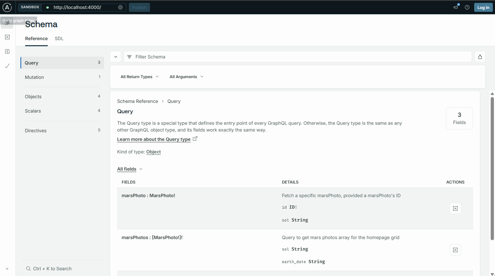
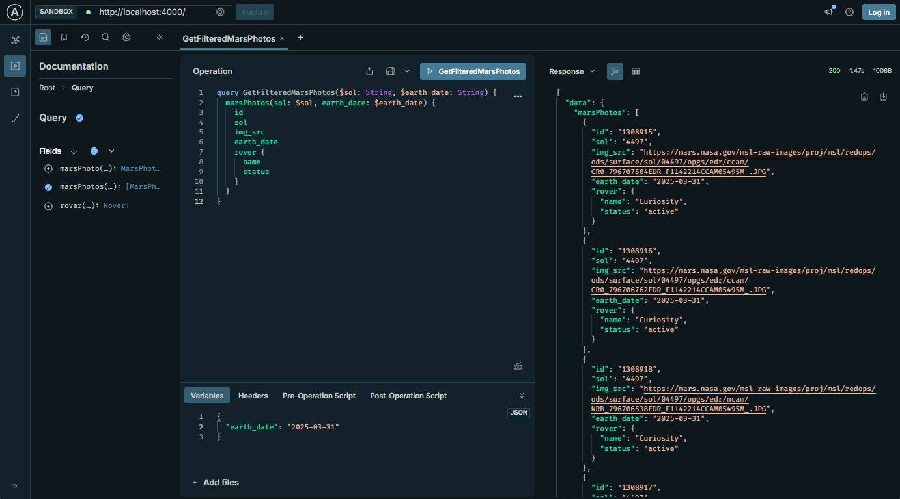

# 🪐🛰️ NASA Mars Rovers GraphQL Server

A GraphQL API server built with **TypeScript** and **Node.js**, designed to provide data about NASA's Mars Rovers. This project leverages **GraphQL** for efficient data querying and follows modern software design practices for scalability and maintainability.

Explore the wonders of Mars with this GraphQL server! 🔭

## 📑 Table of Contents
- [🧑‍💻  Features](#-features)
- [🎨 Technology Stack](#️-technology-stack)
- [🗂️ Project Structure](#-project-structure)
- [📖 How to Use This Repo](#-how-to-use-this-repo)
- [🔍 Example Queries](#-example-queries)
- [🔮 Future Improvements](#-future-improvements)
- [📜 License](#-license)

## 🧑‍💻 Features
- Fetch a list of Mars Rover photos and Filter photos by Martian Sol or Earth Date.
- Retrieve detailed information about a specific photo.
- Increment the view count for a photo.
- Query data efficiently using GraphQL.

## 🎨 Technology Stack

### Key Technologies
| Technology       | Purpose                                                                 |
|------------------|-------------------------------------------------------------------------|
| **GraphQL**      | Provides a flexible and efficient API for querying data.               |
| **TypeScript**   | Ensures type safety and better developer experience.                   |
| **Node.js**      | Powers the server runtime.                                             |
| **Apollo Server**| Simplifies the implementation of the GraphQL API.                      |
| **GraphQL Code Generator** | Automatically generates TypeScript types and resolvers.      |
| **RESTDataSource** | Used to interact with NASA's REST API.                                |

### Design Practices
- **API First / Schema First**: The GraphQL schema is defined first, serving as the contract for the API and ensuring consistency between the client and server. This also enables parallel development between client and server.
- **Type-Safe Development**: TypeScript is used throughout the project to reduce runtime errors and improve code quality.
- **Separation of Concerns**: The project is modular, with clear separation between schema definitions, resolvers, and data sources.
- **Code Generation**: GraphQL Code Generator is used to generate types and resolvers, ensuring consistency between the schema and implementation.
- **Environment Variables**: Sensitive data like API keys are managed using `.env` files.

## 🗂️ Project Structure

The project is organized as follows:

```
src/
├── api-contract/         # GraphQL schema and example queries
├── context.ts            # Context definition for Apollo Server
├── datasources/          # Data sources for interacting with external APIs
├── models/               # TypeScript models for domain entities
├── resolvers/            # GraphQL resolvers implementation
├── schema.ts             # Schema loading and executable schema creation
├── types.ts              # Auto-generated TypeScript types for GraphQL
└── index.ts              # Entry point for the server
```

### Key Files
- **`src/schema.ts`**: Loads the GraphQL schema and creates an executable schema.
- **`src/resolvers/resolvers.ts`**: Implements the logic for GraphQL queries and mutations.
- **`src/datasources/nasa-mars-api.ts`**: Handles communication with NASA's Mars Rover API.
- **`src/types.ts`**: Contains TypeScript types generated from the GraphQL schema.

## 📖 How to Use This Repo

Follow these steps to set up and run the server:

### ⚙️ Setup

1. Navigate to the `server` folder:
   ```sh
   cd server
   ```
2. Install dependencies:
   ```sh
   npm install
   ```

### 🚀 Running the Server

#### Development Mode:
Run the server in development mode with live reloading:
   ```sh
   npm run dev
   ```

#### Production Mode:
Start the server in production mode:
   ```sh
   npm start
   ```

This will launch the GraphQL API server, ready to handle requests. 🚀

## 🔍 Example Queries

Here are some example queries you can use to interact with the API:

### Fetch All Mars Photos
```graphql
query GetMarsPhotos {
  marsPhotos {
    id
    sol
    camera {
      name
      full_name
    }
    img_src
    earth_date
    number_of_views
    rover {
      name
      status
    }
  }
}
```

### Fetch Mars Photos Filtered by Sol or Earth Date
```graphql
query GetFilteredMarsPhotos($sol: String, $earth_date: String) {
  marsPhotos(sol: $sol, earth_date: $earth_date) {
    id
    sol
    img_src
    earth_date
    rover {
      name
      status
    }
  }
}
```

#### Example Variables
```json
{
  "sol": "1000",
  "earth_date": "2023-09-01"
}
```

### Fetch a Specific Mars Photo by ID and Sol
```graphql
query GetMarsPhoto($id: ID!, $sol: String) {
  marsPhoto(id: $id, sol: $sol) {
    id
    sol
    img_src
    earth_date
    camera {
      name
      full_name
    }
    rover {
      name
      landing_date
      launch_date
    }
  }
}
```

#### Example Variables
```json
{
  "id": "m_1",
  "sol": "1000"
}
```

This query allows you to fetch a specific Mars photo by its ID and optionally filter it by the Martian sol.

### Increment the View Count of a Mars Photo
```graphql
mutation IncrementMarsPhotoViews($id: ID!) {
  incrementMarsPhotoViews(id: $id) {
    code
    success
    message
    marsPhoto {
      id
      number_of_views
    }
  }
}
```

This query allows you to filter Mars photos by either the Martian sol or the Earth date. You can provide one or both filters as needed.


### Examples Sandbox UI GraphQL Server



## 🔮 Future Improvements
- Expand the API to include data from other NASA missions.
- Use a dedicated database (e.g., MongoDB) to store application-specific data.
- Add more filtering and sorting options for photos.
- Implement user authentication for personalized features.

## 📜 License

This project is licensed under the MIT License. See the `LICENSE` file for details.